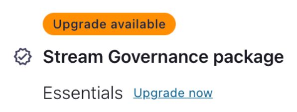
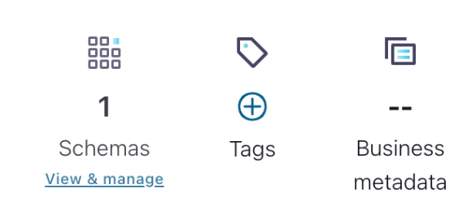

## Description

We will enable the Advanced Governance package and explore some of its features.

### Enable Advanced Governance

The first thing we need to do is to turn on the **Advanced Governance** features.

1. From the main menu (top right) or the breadcrumb navigation (top) select **Environments.**

2. Select your governing environment.

3. On the right-hand side of the screen you should see an option to upgrade your stream governance package. Choose Upgrade now, then select the Advanced package and upgrade to it.

   

### Business Meta Data

This is data that we want available on the schema that is not necessarily part of the schema itself. For example, if someone looks up the schema we may want them to see business metadata indicating who is responsible for that schema. That way, if they have questions, or require modifications, they will know who to contact.

1. Similar to how we created tags, we can also create Business metadata.
   

2. Create a new metadata record with the following details:
   * Name: Contact
   * Description: Who to contact for information about this schema.
   * Attribute 1: first_name
   * Attribute 2: last_name
   * Attribute 3: email_address

3. Using the Stream Catalog, navigate to the **OrderCreated** schema.

4. On the right-hand side, add business metadata.

5. Select **Contact** then add your details as the Contact information.

6. Add the appropriate Business metadata to your other schemas as well.

### Search using GraphQL

Previously, we explored how to search the catalog using the REST API. However, with Advanced Governance, we can choose a GraphQL API instead.

1. Search the Stream Catalog for the **orderId** field using the following curl command:


```bash
curl --silent -u <API-KEY>:<API-SECRET> \
--request POST \
-H 'content-type: application/json' \
--url '<SCHEMA-REGISTRY-URL>/catalog/graphql' \
--data '{	"query":"{ sr_field(where: { name: { _eq: \"orderId\" } }) { name qualifiedName } }" }' | jq
```
run:
```bash
./exercise.sh stage 13
```
2. Now let's try searching for the **PII** tag.

```bash
curl --silent -u <API-KEY>:<API-SECRET> \
--request POST \
-H 'content-type: application/json' \
--url '<SCHEMA-REGISTRY-URL>/catalog/graphql' \
--data '{	"query":"{ sr_field(tags: [\"PII\"]) { name qualifiedName } }" }' | jq
```

3. Let's search for the **PaymentService** tag.

```bash
curl --silent -u <API-KEY>:<API-SECRET> \
--request POST \
-H 'content-type: application/json' \
--url '<SCHEMA-REGISTRY-URL>/catalog/graphql' \
--data '{ "query":"{ sr_schema(tags: [\"PaymentService\"]) { name qualifiedName } }" }'
```

If you were dilegent in tagging your schemas, this should return entries for both the PaymentSucceeded and PaymentFailed events.

### Using the Search Feature

Another feature enabled by the Advanced Governance package is **Lineage Search.**

1. Navigate to the Stream Lineage.

2. At the top of the lineage, you should see a Search box.

3. Select the search box and try searching for parts of the lineage (eg. **PaymentService**).

> The search will accept Client Ids, Topic Names, Application Ids, and more.

### View the Point-in-Time Lineage

Another Stream Lineage feature that is introduced by the Advanced Governance package is Point-in-Time Lineage. By default, the lineage is built using the last 10 minutes of data. However, if you want to see how your lineage has evolved over time, you can rewind to see what it looked like in the past.

1. To view your lineage at a different point in time, you can adjust the time filter.

2. Try adjusting the time frame.


[go back to Agenda](https://github.com/jr-marquez/Workshop_Confluent/blob/main/README.md#confluent-hands-on-workshop)