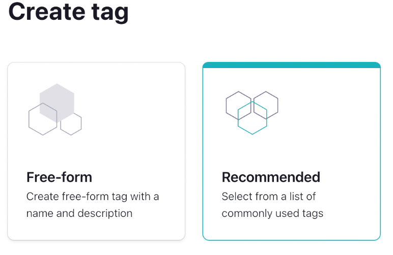
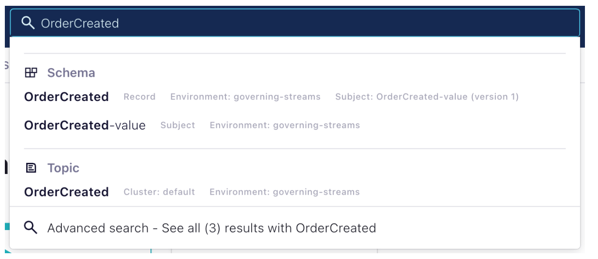
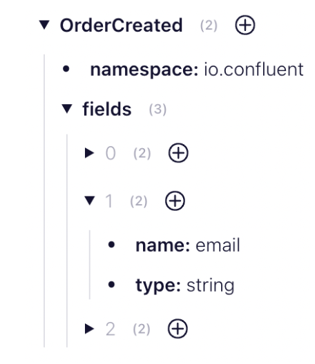
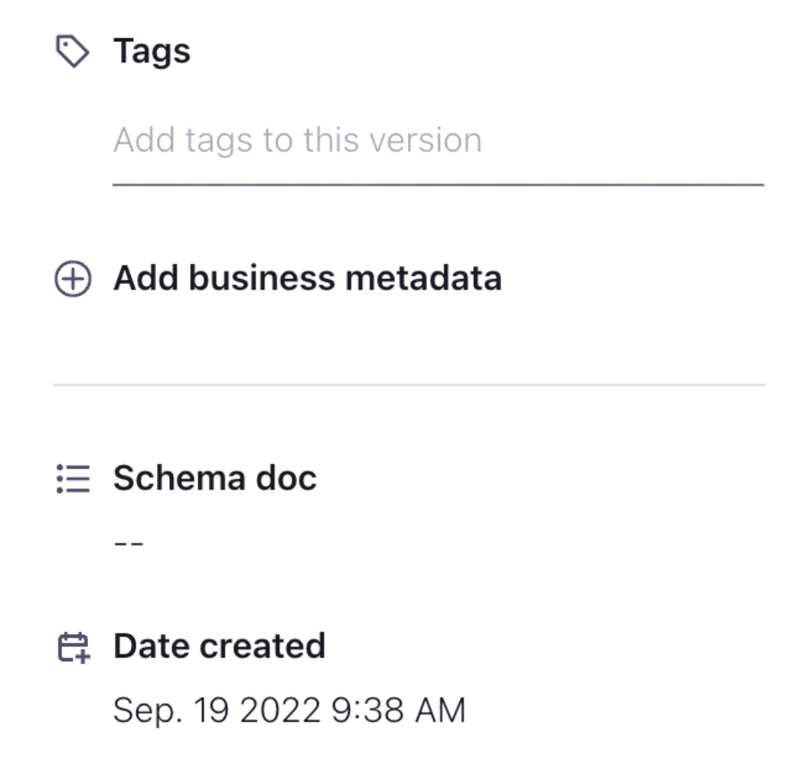

### Description

We will be cataloging the stream that we created in the previous exercise by adding tags and descriptions to it

### Stage the Exercise

Lets stage the exercise, inside
```bash
cd /home/ec2-user/governing-data-streams/exercises
```
run:
```bash
./exercise.sh stage 10
```
### Create Tags

1. Select your exercise Environment

2. On the right-hand side, you will see a section that includes **Schemas, Tags, and Business metadata** (Business metadata is disabled). Click the + button above Tags


3. On the next screen, select **Get Started.**

4. Next, you'll be given an option to create a Free-Form or a Recommended tag. Select **Recommended.**



5. Select the PII tag then hit the **Create** button

6. Next, let's create one more tag. This one will be a Free-Form tag. Create it with the following settings:
    * **Tag Name:** OrderService
    * **Description:** Streams originating from the Order Service

### Tag the Schema

Now that we've created a tag, we need to use it. 

We'll start by navigating to our Schema using the Stream Catalog

1. At the top of your screen you should see a search box for the Stream Catalog. 


2. Search the Stream Catalog for OrderCreated. You should see multiple results.



3. We want to add our tags to the **OrderCreated-value** schema. Select it from the list.

4. We want to locate the field for email. You can do that by expanding the fields



5. Once you have located the field, select the + button beside the field and add the **PII** tag.

6. On the right hand side, you will see a place where you can tag individual versions of your record. Tag the current version using the **OrderService** tag.



7. Try searching for the **PII** tag in the Stream Catalog.

### Descriptions

In addition to tags, you can also add a text description to the schema. This can be useful to help users understand the purpose and structure of the data.
1. In the same place we added a tag select the Description field and add an appropriate description for the schema.
Eg. "This event is produced each time an order is created. It contains the full details of the order."

### Create a New Topic

Now that we know how to create and apply tags and descriptions, let's enrich our data model a little more

> In our application flow, an order will be created, then a payment is applied to that order. That payment can succeed or fail. However, for the moment we'll only deal with the successes.

1. Create a new topic named **PaymentSucceeded.**

2. Apply the following schema to the topic:

```bash
{
   "type":"record",
   "name":"PaymentSucceeded",
   "doc":"An event that is produced each time a payment is successful.",
   "namespace":"io.confluent",
   "fields":[
      {
         "name":"paymentId",
     	   "doc":"A unique identifier for this payment.",
         "type":"string"
      },
      {
         "name":"orderId",
    	   "doc":"The unique identifier for the order that this payment is attached to.",
         "type":"string"
      },
      {
         "name":"amount",
    	   "doc":"The amount of the payment (in US Dollars).",
         "type":"double"
      }
   ]
}
```
3. Create a new tag with the following details:
    * **Tag Name:** PaymentService
    * **Description:** Streams originating from the Payment Service

4. Apply the **PaymentService** tag to the **PaymentSucceeded** schema.

5. Provide a description for the event.

### Run the application

Now that we've created a new topic, we need to run our application to populate that topic. We now have two services to run: the OrderService and the PaymentService. Unlike the OrderService, the PaymentService will be listening to or OrderCreated topic and only generating new events in response to the OrderCreated events. This means that some of the data (i.e. orderId) will actually originate from the previous event.

1. Download the new schema:

```bash
mvn schema-registry:download
```
2. Compile the code with the new schema:

```bash
mvn clean compile package
```

3. Run the OrderService

```bash
mvn exec:java -Dexec.mainClass="io.confluent.OrderService"
```

4. In a new terminal, run the PaymentService

```bash
mvn exec:java -Dexec.mainClass="io.confluent.PaymentService"
```

### Search using REST

The functionality to work with the Stream Catalog is also available through a REST API. Let's take a quick look at how it works.

1. Search the Stream Catalog for the **orderId** field using the following curl command:

```bash
curl --silent -u <API-KEY>:<API-SECRET> \
--request GET \
--url '<SCHEMA-REGISTRY-URL>/catalog/v1/search/basic?query=orderId' | jq
```
This should return three results including the orderId from both versions of the OrderCreated event and from the PaymentSucceeded event.

2. Now let's try searching for the **PII** tag.

```bash
curl --silent -u <API-KEY>:<API-SECRET> \
--request GET \
--url '<SCHEMA-REGISTRY-URL>/catalog/v1/search/basic?type=sr_field&tag=PII' | jq
```
This should return a single result which will be the email from the OrderCreated event.

3. Let's search for the **PaymentService** tag.

```bash
curl --silent -u <API-KEY>:<API-SECRET> \
--request GET \
--url '<SCHEMA-REGISTRY-URL>/catalog/v1/search/basic?type=sr_schema&tag=PaymentService' | jq
```


[go back to Agenda](https://github.com/jr-marquez/Workshop_Confluent/blob/main/README.md#confluent-hands-on-workshop)