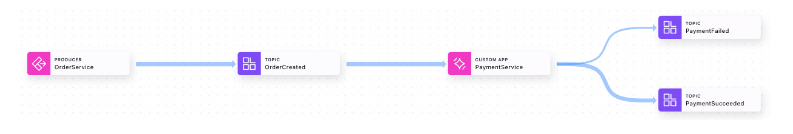

## Description

As we have been working through our exercises and slowly building up a pipeline of data, Confluent Cloud has been building a map of that pipeline. You can view this map through the Stream Lineag

### Stage the Exercise

Lets stage the exercise, inside
```bash
cd /home/ec2-user/governing-data-streams/exercises
```
run:
```bash
./exercise.sh stage 13
```

### View the Current Lineage

1. Compile and run the **OrderService** and **PaymentService**

```bash
mvn clean compile package
```
```bash
mvn exec:java -Dexec.mainClass="io.confluent.OrderService"
```
```bash
mvn exec:java -Dexec.mainClass="io.confluent.PaymentService"
```

2. In your Confluent Cluster, select **Stream lineage** from the left-hand navigation.

### Create the PaymentFailed Topic

To add a branch in our logic, we are going to modify the PaymentService to emit failure events in addition to successes. To do that, we will need a new topic to contain our failure events

1. Start by adding a new topic named **PaymentFailed.**

2. Next, add a schema for the topic. This schema is identical to the **PaymentSucceed** schema, except that it contains a **reason** for the failure.

```bash
{
   "type":"record",
   "name":"PaymentFailed",
   "doc":"An event that is produced each time a payment is successful.",
   "namespace":"io.confluent",
   "fields":[
      {
         "name":"paymentId",
     	   "doc":"A unique identifier for this payment.",
         "type":"string"
      },
      {
         "name":"orderId",
    	   "doc":"The unique identifier for the order that this payment is attached to.",
         "type":"string"
      },
      {
         "name":"amount",
    	   "doc":"The amount of the payment (in US Dollars).",
         "type":"double"
      },
      {
         "name":"reason",
         "doc":"A text description for why the payment failed.",
         "type":"string"
      }
   ]
}	
```
3. Tag this schema with the appropriate tags and add a description.

### Modify the Payment Service

Next, we need to modify the PaymentService to emit the proper events.

1. Start by downloading the schema.

```bash
mvn schema-registry:download
```

2. Next, we will modify PaymentService.java (you can open it if you wish)

```bash
./exercise.sh solve 13 PaymentService.java
```
3. Compile and execute the **OrderService** and the **PaymentService.**

```bash
mvn clean compile package
```
```bash
mvn exec:java -Dexec.mainClass="io.confluent.OrderService"
```
```bash
mvn exec:java -Dexec.mainClass="io.confluent.PaymentService"
```
### View the Stream Lineage

1. Open the Stream Lineage. You should see something like the following:



> It takes time for the lineage to update. If you don't see a change immediately, try refreshing the page after a few minutes.

### Run the ShippingService

nce a payment has been processed successfully, the next step is to ship the product. We are going to run a ShippingService that will consume the PaymentSucceeded events, but not the PaymentFailed events. Then we will see how that impacts our lineage.

1. Run the ShippingService in a new terminal.

```bash
mvn exec:java -Dexec.mainClass="io.confluent.ShippingService"
```

2. Inspect the Stream Lineage.


[go back to Agenda](https://github.com/jr-marquez/Workshop_Confluent/blob/main/README.md#confluent-hands-on-workshop)