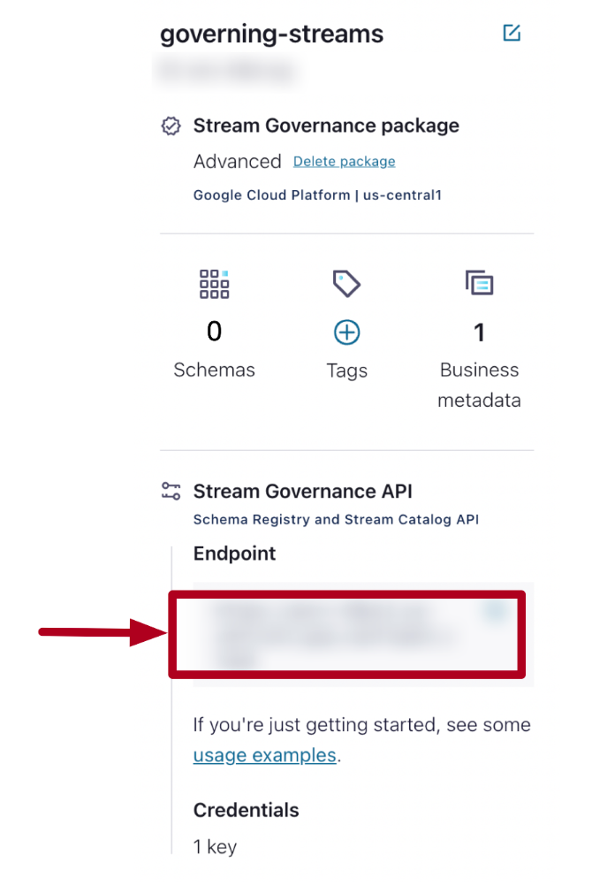

## Description

 We will define a basic schema for what the order should look like. Then, we will execute a small application that will push random order data into a topic with that schema. Later in the exercise, we will apply a small evolution to the schema and update the code accordingly.

### Add Cluster and Schema Registry API Keys

You will need to add your Cluster API credentials and your Schema Registry API credentials in a couple of places

Go to 
```bash
cd /home/ec2-user/governing-data-streams/exercises
```

1. Open the **pom.xml** file.
```bash
vi pom.xml
```

2. In the **properties** section you will find three blank propertie

```bash
<schema.registry.url>{{ SR_URL }}</schema.registry.url>
<schema.registry.apikey>{{ SR_API_KEY }}</schema.registry.apikey>
<schema.registry.apisecret>{{ SR_API_SECRET }}</schema.registry.apisecret>
```
> you can edit the file with the i letter , once done (in order) : ESC --> : --> wq!

You can obtain the schema registry url by navigating to the Environment and viewing the details on the right hand side of the screen:
    

3. Create API Key for Schema Registry and store the values , complete the **pom.xml**

    

4. Create API Keys for Confluent Cluster, inside the cluster settings and API Keys select **Create Key**
   
    

5. Select Global Scope, download and save the info

    

6. Open the **src/main/resources/java.config** file inside /home/ec2-user/governing-data-streams/exercises

note the use of the following settings:

```bash
auto.register.schemas=false
use.latest.version=true
```

7. Replace the following placeholders with the corresponding values

> you can edit the file with the i letter , once done (in order) : ESC --> : --> wq!

```bash
{{ CLUSTER_URL }}
{{ CLUSTER_API_KEY }}
{{ CLUSTER_API_SECRET }}
{{ SR_URL }}
{{ SR_API_KEY }}
{{ SR_API_SECRET }}
```

You can obtain the Cluster URL by navigating to the **Cluster Overview > Cluster Settings**, and looking for the Bootstrap Server


### Create a Topic

Next, we need to create a topic for our application to push messages into. Create the topic **OrderCreated**

1. In the left-hand side navigation for your cluster, select Topics.

    

2. Create a new topic.

3. Name the topic **OrderCreated**

### Add a Schema

Now that we have a topic created, our next step is to attach a schema.

1. Navigate to Topics, and select the OrderCreated topic.

2. At the top, you will see a set of tabs. Select the tab for **Schema**

3. Choose **Value** (this is the default).

4. Select **Set a schema.**

5. Select **Avro** for your Schema.

6. Next, we need to provide the schema itself. We are going to use the following schema

```bash
{
    "type":"record",
    "name":"OrderCreated",
    "doc":"An event that is produced each time an order is created.",
    "namespace":"io.confluent",
    "fields":[
        {
            "name":"orderId",
            "doc":"The unique identifier for the order.",
            "type":"string"
        },
        {
            "name":"items",
            "doc":"A list of items in the order",
            "type": {
                "type":"array",
                "items":{
                    "name":"Item",
                    "type":"record",
                    "fields":[
                        {
                            "name":"itemId",
                            "doc":"The unique identifier for the item.",
                            "type":"string"
                        },
                        {
                            "name":"quantity",
                            "doc":"The quantity of the item in the order.",
                            "type":"int"
                        }
                    ]
                }
            }
        }
    ]
}
```

Take a look at the schema. 

7. Validate the schema and then Create it.

8. Using the left-hand navigation, select the **Schema registry.**

    

Here, you should see that a Schema has been created named **OrderCreated-value.**

### Download and Compile the Schema

Next, we need to make use of the schema inside our application

1. Before we download the schema, let's quickly try to compile the code

```bash
mvn clean compile package
```
> This will fail because it doesn't know what an OrderCreated event is. We haven't defined it.

2. To resolve this, let's download our schema using the Schema Registry maven plugin:

```bash
mvn schema-registry:download
```
3. Try compiling the code again. 


### Run the Application

Now that we have compiled the code, we can run the application.

1. Run the OrderService by executing:

```bash
mvn exec:java -Dexec.mainClass="io.confluent.OrderService"
```
2. The application should begin producing messages to the OrderCreated topic. Check it in the messages tab

3. Let the application run for a few moments, then terminate it using <CTRL-C>

### Update the Schema

Next, we are going to apply a small update to the schema

1. Navigate to the schema either from the topic or through the schema registry.

2. Click the **Evolve Schema** button. This will open your schema for editing.

3. Copy and paste the following into the **fields** section of the schema (beneath the **orderId**):

```bash
{
	"name":"email",
	"doc":"The email address for the customer placing the order.",
	"type":"string"
},
```
4. Try to validate the schema.


> **Best Practice:** When working with backward compatibility update the schema, then update the consumers to use the new schema, and finally update the producer. This ensures that your consumers will always be able to process the messages being produced

5. Add a default value to the email address:

```bash
{
	"name":"email",
	"doc":"The email address for the customer placing the order.",
	"type":"string",
	"default":"null"
},
```

6. Validate and save the schema.

7. Notice that in the Schema view you have an option to select different versions of the schema

### Update the OrderService

Now that we have an updated schema, the next step is to update our message producer.

1. Download the new schema by running:

```bash
mvn schema-registry:download
```

2. If you try to compile the code, you'll discover that there is no suitable constructor for the OrderCreated class. This is because there is now an additional field to account for.

3. To solve this (we are not going to develop in Java), run:

```bash
./exercise.sh solve 07 OrderService.java
```
4. Compile and run the application again.

[go back to Agenda](https://github.com/jr-marquez/Workshop_Confluent/blob/main/README.md#confluent-hands-on-workshop)