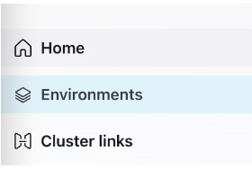

## Initial Steps

In this exercise, you will be setting up a Confluent Cloud Cluster that you will be able to use for the rest of the course.

### Create a New Environment
In this first part we will create a new environment isolated from the rest of the course . 

1. From the left-hand navigation menu select "Environments".

2. Click **+ Add cloud environment**

3. Name your environment "governing-streams".

4. When offered a choice on which Stream Governance Package to choose, click **Begin Configuration** under the Essentials option.

5. Select which cloud and region you want to create your Schema Registry and Stream Catalog in (i.e. where you will be storing the metadata).

### Create a Cluster

1. Inside the **governing-streams** environment click **Create cluster on my own.** You'll be given a choice of what kind of cluster to create

2. On the next page, choose your cloud provider, region, and availability (zone). 

3. Next, you will be asked to enter your credit card information. Feel free to choose the "Skip Payment" option at the bottom of the screen.

4. Give your cluster a name, and select Launch cluster.

[go back to Agenda](https://github.com/jr-marquez/Workshop_Confluent/blob/main/README.md#confluent-hands-on-workshop)